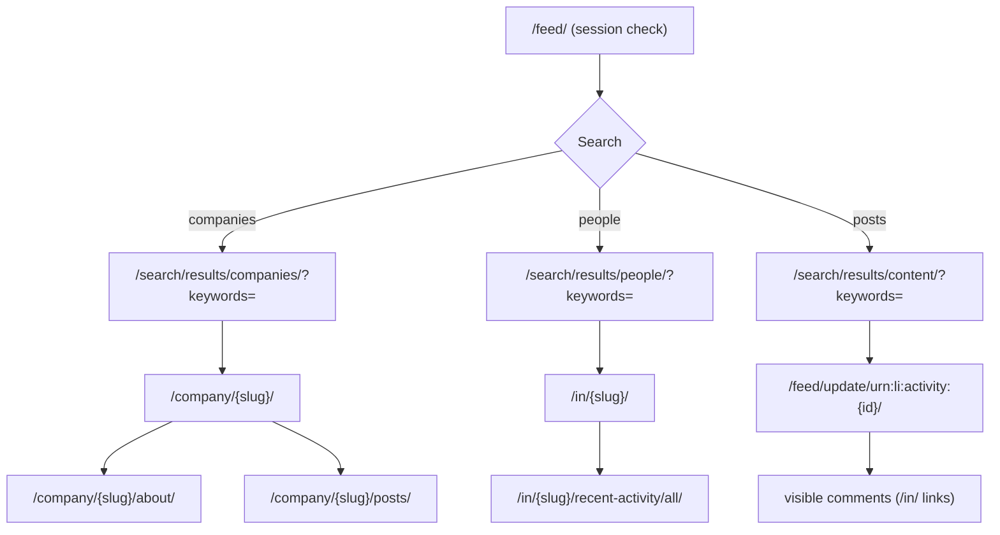

# LinkedIn read-only navigation map

Verified 2026-07-12 against the live session (interface language: **German /
de-DE**; account authenticated). All routes below are **read-only navigation**.
Prefer direct URL navigation over clicking; it is more robust and equally read-only.

## Global
| Element | Type | Accessible name (de) | Strategy |
| --- | --- | --- | --- |
| Session indicator | button | `Sie` | role+name; also `/mynetwork` href |
| Global search | textbox | `Suche` | inside `search` landmark; role null on raw input |

## Search results
| Route | Empty state | Pagination |
| --- | --- | --- |
| `/search/results/companies/?keywords=` | heading `Keine Ergebnisse gefunden` + button `Suche bearbeiten` | `Weiter` / `Zurück` |
| `/search/results/people/?keywords=` | same | same |
| `/search/results/content/?keywords=` | same | same |

- **Company card:** `ul>li` containing `a[href*="/company/"]` → canonical `linkedin.com/company/{slug}/`.
- **People card:** `role=listitem` (div) containing `a[href*="/in/"]` → canonical
  `linkedin.com/in/{slug}/`; card text = name + degree (`• 2.`) + headline.

## Company page
Tabs (verified): `Start` · `Info` · `Beiträge` · `Personen` · `Einblicke`.
- **About** `/company/{slug}/about/` — `dt/dd` overview:
  `Website`, `Branche`, `Größe`, `Hauptsitz`, `Gegründet`, `Spezialgebiete`,
  `Verifizierte Seite`.
- **Posts** `/company/{slug}/posts/` — posts carry `data-urn="urn:li:activity:{id}"`.
- ⛔ `Folgen`, `Nachricht` present on the page — never click.

## Profile page `/in/{slug}/`
Section headings (verified): `Aktivitäten` · `Erfahrung` · `Ausbildung` ·
`Kenntnisse` · `Interessen`. Name via `document.title` = `"{Name} | LinkedIn"`
(plain `h1` can be empty).
- Activity: `/in/{slug}/recent-activity/all/`.
- ⛔ `…folgen`, `Nachricht`, and `Vernetzen` (often under `Mehr`) — never click.
- ⛔ Never open `Kontaktinfo` / Contact info.

## Post `/feed/update/urn:li:activity:{id}/`
- Container: `data-urn="urn:li:activity:{id}"`.
- Date formats: `3 Tage •`, `1 Woche(n) •`, `8 Monat(e) •`, `3 Woche(n) • Bearbeitet •`
  (units: `Min.` `Std.` `Tag(e)` `Woche(n)` `Monat(e)` `Jahr(e)`).
- Counts (context only): `16 Reaktionen`, `1 Kommentar`.
- Commenters: `a[href*="/in/"]` in the comments region; exclude author + session user.
- ⛔ `Mit „Gefällt mir" reagieren`, `Kommentieren`, `Reposten`, `Senden` — never click.

## Conservative-block note
The empty-state `Suche bearbeiten` and any element named `Bearbeiten` are
intentionally blocked by the safe layer (the denylist matches `edit`/`bearbeiten`).
This is by design — navigate by URL instead.
